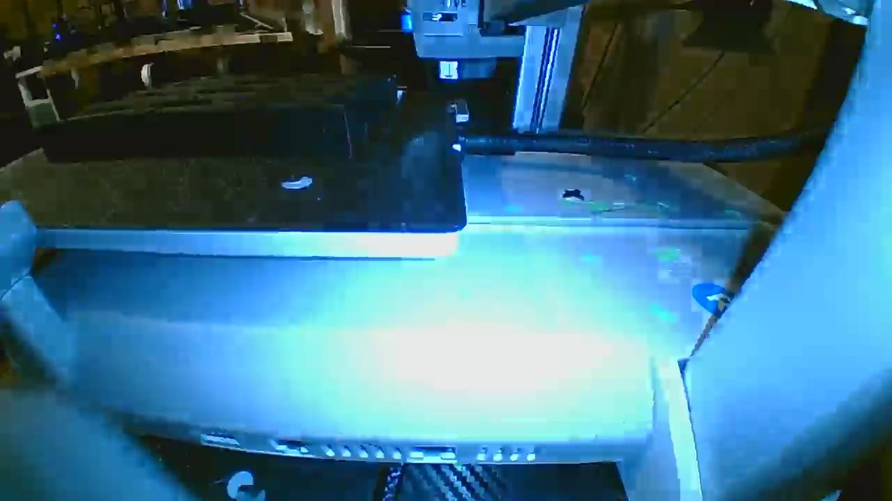
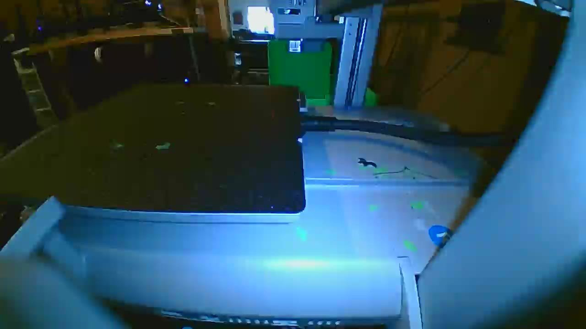
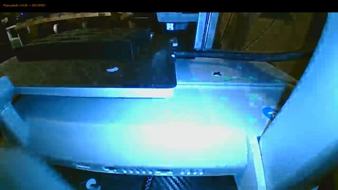
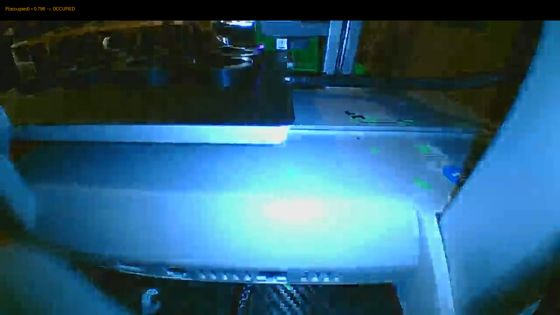
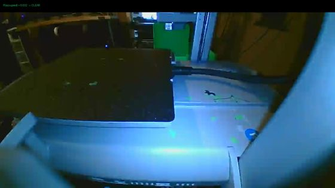
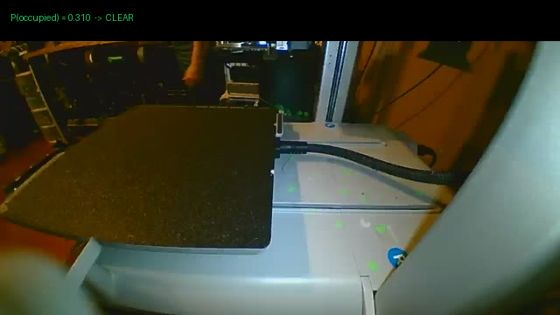

# BedNet — 3D Printer Bed Occupancy Classifier

**GitHub:** https://github.com/SugaryCoffee00/BedNet · **Hugging Face:** https://huggingface.co/SugaryCoffee/BedNet


Binary image classifier that answers one question from a fixed bed-camera view: **is there a printed object on the print bed?** Built for autonomous 3D-print-farm fulfillment (auto-releasing completed prints without a human looking at every camera frame).




## Model at a glance

| | |
|---|---|
| Task | binary image classification (bed clear vs occupied) |
| Architecture | EfficientNet-B0 (ImageNet-pretrained backbone, fine-tuned end-to-end) |
| Parameters | **4,010,110 (~4.0 M)** — of which the new 2-class head is 2,562 |
| Model size | 16 MB fp32 (`.pt` and `.onnx`) |
| Input | RGB image, resized bilinear to **288×288**, ImageNet normalization |
| Output | `[clear, occupied]` logits → softmax → `P(occupied)` |
| Speed | ~30 ms/frame CPU (onnxruntime-node) · <5 ms/frame GPU |
| Training data | ~1,200 farm bed-camera frames, operator-audited labels (see caveat below) |
| License | CC-BY 4.0 (attribution required) |

## What it does — example outputs

Live inference on frames from two printers never seen during training. Banner shows the model's actual output:

| | |
|---|---|
|  |  |
|  |  |


## What it is

- **Architecture:** EfficientNet-B0 (ImageNet-pretrained), final layer replaced with a 2-class head (`clear` / `occupied`). Input 288×288, ImageNet normalization, bilinear resize.
- **Domain:** fixed-position bed cameras on FDM printers (PEI/spring-steel sheets, mixed workshop lighting). Not designed for arbitrary photos of 3D prints.
- **Deployment:** exported to ONNX (opset 17), runs in-process via `onnxruntime-node` in ~30 ms CPU / <5 ms GPU per frame. Ships as a fast-path: only confident "clear" predictions auto-release; everything else falls through to a human or an LLM reviewer.

## Training data

~1,200 frames from 29 farm printers. Labels derived from operational events and then **manually audited by the operator** (7 corrections applied via a review tool):

| Label | Source | Meaning |
|---|---|---|
| clear | `manual-clear-*` frames | operator confirmed bed empty after removing parts |
| clear | baseline-match PASS | pixel diff against the printer's empty-bed baseline |
| occupied | `post-print-reference-*` | captured at print completion, part still on bed |
| occupied | parts_present BLOCKED | still matches the occupied reference |

Convention: **clear means a clean bed** — filament scraps and debris count as occupied.

Split is group-aware (all frames from one printer/camera go to exactly one split), so test frames come from devices never seen in training.

## ✅ BedNet v2: in production (2026-09-26)

v1 was pulled from production on 2026-09-25 after human review found printed parts in 15/15 held-out frames it scored as confidently empty — accuracy metrics computed against partially noisy labels had hidden the failure mode (dark/small parts on dark textured beds).

**BedNet v2**, retrained on the fully corrected label set (1,234 operator-validated labels), reaches **95.0% test accuracy / 0.978 AUC**. It ran in live shadow mode first: across 28 shadow-scored bed checks, **zero DANGER events** (no case where v2 would release and the LLM judge blocked); 6 releases agreed with the judge, 5 conservative misses cost speed only. As of 2026-09-26 v2 is enabled for real production releases behind that shadow validation — it fast-paths confident clears and never overrides other safety checks.

Standing lesson from v1: single-image "is this empty?" classification is hard for farms with varied dark beds — condition the decision on label quality and, where possible, the printer's own baseline image. A twin-encoder pair model (reference frame + current frame → part_added / clear_removed / clear_unchanged) remains the next-generation candidate.

---

## Results

Scored on the held-out test split (201 frames, unseen printers) against **operator-validated labels**:

| | accuracy | precision | recall |
|---|---|---|---|
| overall | **0.891** | | |
| occupied | | 0.893 | 0.909 |
| clear | | 0.888 | 0.868 |

In production calibration (thresholded at P(occupied) ≤ 0.15 for auto-release, on the shipped ONNX preprocessing): **zero false releases** across the held-out set; first false release appears at threshold 0.20. The model is used as a *speed-up only* — it can fast-path confident clears but never overrides other safety checks.

### Before vs after fine-tuning (same held-out test set)

| | accuracy | AUC |
|---|---|---|
| Random guess | 0.500 | 0.500 |
| Frozen ImageNet backbone + linear probe (i.e. *before* fine-tuning) | 0.896 | 0.957 |
| **BedNet (full fine-tune)** | **0.891** | **0.960** |

Honest reading: with only ~1,200 training frames, full fine-tuning beats a trivial linear probe only slightly — ImageNet's backbone already recognizes printed objects well. Fine-tuning's real gains are the calibrated probabilities (which make the zero-false-release threshold possible), Grad-CAM localization, and a small deployable model. Both rows hit the same wall: **more labeled data, not more training tricks, is what moves this number.**

> **Read these numbers with context:** training data was very limited (~1,200 frames from one print farm). More labeled data would give a better model — see Limitations.

## Files

| file | description |
|---|---|
| `bednet.pt` | PyTorch checkpoint (EfficientNet-B0, 2-class head) |
| `bednet.onnx` | deployed ONNX export (opset 17), bit-identical argmax to PyTorch on real frames |

## Usage (PyTorch)

```python
import torch
from torchvision import models, transforms
from PIL import Image

m = models.efficientnet_b0(weights=None)
m.classifier[1] = torch.nn.Linear(m.classifier[1].in_features, 2)
m.load_state_dict(torch.load("bednet.pt", map_location="cpu", weights_only=False)["state_dict"])
m.eval()

tfm = transforms.Compose([
    transforms.Resize((288, 288)),   # bilinear — keep the default, Lanczos shifts calibration
    transforms.ToTensor(),
    transforms.Normalize([0.485, 0.456, 0.406], [0.229, 0.224, 0.225]),
])

with torch.no_grad():
    p_occupied = float(torch.softmax(m(tfm(Image.open("frame.jpg").convert("RGB"))[None]), 1)[0, 1])

print(f"P(occupied) = {p_occupied:.3f}")   # auto-release beds at <= 0.15; do not exceed ~0.2 without recalibration
```

## Usage (ONNX Runtime)

Preprocess exactly as above (resize **bilinear** to 288×288 — in `sharp` use `kernel: "linear"`), normalize with ImageNet stats, NCHW float32 input named from the graph. Output is `[1, 2]` logits `[clear, occupied]`.

```python
import onnxruntime as ort, numpy as np
sess = ort.InferenceSession("bednet.onnx")
# x: (1,3,288,288) float32, ImageNet-normalized
logits = sess.run(None, {sess.get_inputs()[0].name: x})[0]
p_occupied = float(np.exp(logits[0][1]) / np.exp(logits).sum())
```

## Grad-CAM localization

The last EfficientNet feature block supports Grad-CAM against the `occupied` logit; it reliably circles the part driving an occupied call (used in the operator review UI for "why is this flagged").

## Limitations & honest caveats

- **Very limited training data — this is the biggest constraint.** The model was trained on only ~1,200 frames (~700 after deduplication), which is a tiny fraction of what an image classifier normally uses. This number is not a ceiling: with more labeled frames — even a few thousand covering more printers, parts, lighting conditions, and failure modes — the same architecture should get meaningfully better. Treat these metrics as "what's achievable with one farm's worth of data," not what this approach caps out at.
- **Domain-specific.** Trained on frames from one farm's fixed cameras. Expect degradation on new printer models, camera angles, or lighting; recalibrate the release threshold on your own data before automating anything.
- **Not an object detector.** It answers bed-level occupancy only; localization is coarse (Grad-CAM), not boxed detection.
- **Glare and surface texture** are the main false-positive driver; debris/small parts are the main misses.
- The 89.1% test accuracy is on a small (201-frame) holdout — confidence intervals are wide.

## Intended use / out of scope

Intended: gating print-bed verification steps in a 3D-print farm where a human or another system reviews non-confident frames. Not intended: safety-critical autonomy, anything where a false "clear" causes harm without a second check.

## Model spec

| | |
|---|---|
| Architecture | EfficientNet-B0 (ImageNet-pretrained, fully fine-tuned) |
| Parameters | **4,010,110** (~4.0 M total; classifier head 2,562) |
| Input | RGB image, resized to 288×288, ImageNet normalization |
| Output | 2-class softmax → P(occupied) |
| ONNX file size | 16 MB (opset 17) |
| Latency | ~30 ms/frame CPU (intraOp=2), <5 ms GPU |
| Training data | 711 deduped farm bed-cam frames, group-aware split |

## Before / after fine-tuning (held-out test set, operator-validated labels)

| Model | Accuracy | AUC |
|---|---|---|
| Random guess | 0.500 | 0.500 |
| Frozen ImageNet features + linear probe (before fine-tune) | 0.896 | 0.957 |
| **BedNet (full fine-tune)** | **0.891** | **0.960** |

Honest note: with only ~700 usable frames, a trivial linear probe on stock ImageNet features nearly matches the full fine-tune — evidence that data volume, not architecture, is the bottleneck here. The fine-tune buys calibrated probabilities (threshold-based auto-release), Grad-CAM localization, and headroom that grows with more labeled data.

## License & attribution

This model is released under **[CC-BY 4.0](https://creativecommons.org/licenses/by/4.0/)**: you are free to use, modify, and redistribute it — including commercially — **as long as you credit the author**. Attribution means keeping this notice visible wherever the model or its derivatives ship:

> BedNet (c) SugaryCoffee — https://huggingface.co/SugaryCoffee/BedNet — licensed under CC-BY 4.0.

If you use it in a paper, cite:

```bibtex
@misc{bednet2026,
  author       = {SugaryCoffee},
  title        = {BedNet: 3D Printer Bed Occupancy Classifier},
  year         = {2026},
  publisher    = {Hugging Face},
  howpublished = {\url{https://huggingface.co/SugaryCoffee/BedNet}}
}
```
